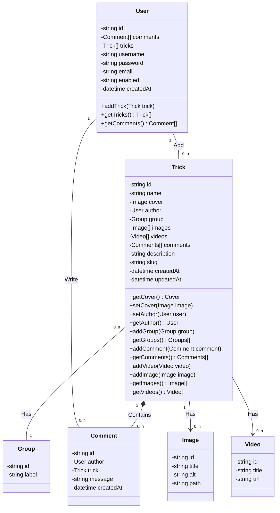

```mermaid
classDiagram

    User "1" -- "0..n" Trick: Add
    Trick "0..n" -- "1" Group: Has
    User "1" -- "0..n" Comment: Write
    Trick "1" *-- "0..n" Comment: Contains
    Trick "1" --> "0..n" Image: Has
    Trick "1" --> "0..n" Video: Has

    class User {
      -string id
      -Comment[] comments
      -Trick[] tricks
      -string username
      -string password
      -string email
      -string enabled
      -datetime createdAt

      +addTrick(Trick trick)
      +getTricks() Trick[]
      +getComments() Comment[]
    }

    class Trick {
        -string id
        -string name
        -Image cover
        -User author
        -Group group
        -Image[] images
        -Video[] videos 
        -Comments[] comments
        -string description
        -string slug
        -datetime createdAt
        -datetime updatedAt

        +getCover() Cover
        +setCover(Image image)
        +setAuthor(User user)
        +getAuthor() User
        +addGroup(Group group)
        +getGroups() Groups[]
        +addComment(Comment comment)
        +getComments() Comments[]
        +addVideo(Video video)
        +addImage(Image image)
        +getImages() Image[]
        +getVideos() Video[]
    }

    class Image {
        -string id
        -string title 
        -string alt
        -string path
    }

    class Video {
        -string id
        -string title
        -string url
    }

    class Group {
        -string id
        -string label
    }

    class Comment {
        -string id
        -User author
        -Trick trick
        -string message
        -datetime createdAt
    }
```
