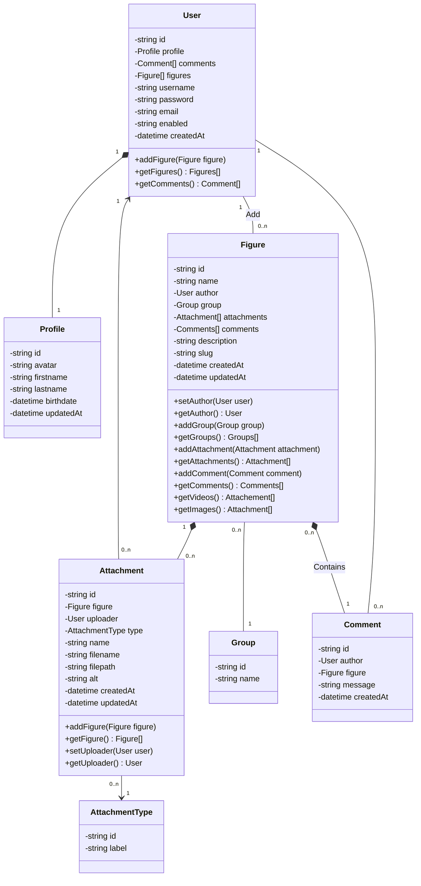

```mermaid
classDiagram

    User "1" *-- "1" Profile
    User "1" -- "0..n" Figure: Add
    Figure "1" *-- "0..n" Attachment
    Attachment "0..n" --> "1" AttachmentType
    Attachment "0..n" -->  "1" User
    Figure "0..n" -- "1" Group
    User "1" -- "0..n" Comment
    Figure "0..n" *-- "1" Comment: Contains

    class User {
      -string id
      -Profile profile
      -Comment[] comments
      -Figure[] figures
      -string username
      -string password
      -string email
      -string enabled
      -datetime createdAt

      +addFigure(Figure figure)
      +getFigures() Figures[]
      +getComments() Comment[]
    }

    class Profile {
        -string id
        -string avatar
        -string firstname
        -string lastname
        -datetime birthdate
        -datetime updatedAt
    }

    class Figure {
        -string id
        -string name
        -User author
        -Group group
        -Attachment[] attachments
        -Comments[] comments
        -string description
        -string slug
        -datetime createdAt
        -datetime updatedAt

        +setAuthor(User user)
        +getAuthor() User
        +addGroup(Group group)
        +getGroups() Groups[]
        +addAttachment(Attachment attachment)
        +getAttachments() Attachment[]
        +addComment(Comment comment)
        +getComments() Comments[]
        +getVideos() Attachement[]
        +getImages() Attachment[]
    }

    class Attachment {
        -string id
        -Figure figure
        -User uploader
        -AttachmentType type
        -string name
        -string filename
        -string filepath
        -string alt
        -datetime createdAt
        -datetime updatedAt

        +addFigure(Figure figure)
        +getFigure() Figure[]
        +setUploader(User user)
        +getUploader() User
    }

    class AttachmentType {
        -string id
        -string label
    }

    class Group {
        -string id
        -string name
    }

    class Comment {
        -string id
        -User author
        -Figure figure
        -string message
        -datetime createdAt
    }

```
