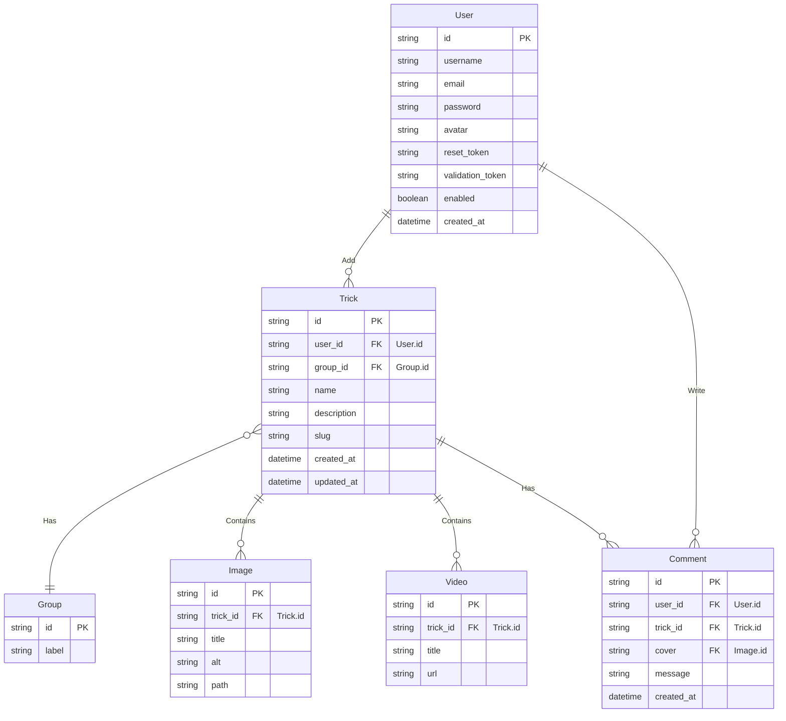

```mermaid
erDiagram
    User {
        string id PK
        string username
        string email
        string password
        string avatar
        string reset_token
        string validation_token
        boolean enabled
        datetime created_at
    }

    Trick {
        string id PK
        string user_id FK "User.id"
        string group_id FK "Group.id"
        string name
        string description
        string slug
        datetime created_at
        datetime updated_at
    }

    Comment {
        string id PK
        string user_id FK "User.id"
        string trick_id FK "Trick.id"
        string cover FK "Image.id"
        string message
        datetime created_at
    }

    Group {
        string id PK
        string label
    }

    Image {
        string id PK
        string trick_id FK "Trick.id"
        string title
        string alt
        string path
    }

    Video {
        string id PK
        string trick_id FK "Trick.id"
        string title
        string url
    }

    User ||--o{ Trick: Add
    User ||--o{ Comment: Write

    Trick }o--|| Group: Has
    Trick ||--o{ Image: Contains
    Trick ||--o{ Video: Contains
    Trick ||--o{ Comment: Has
```
