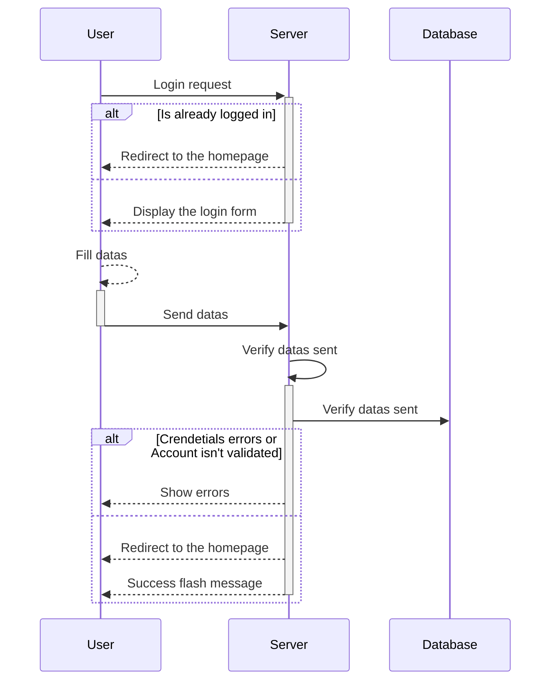

```mermaid
sequenceDiagram
    User ->>+ Server: Login request

    alt Is already logged in 
        Server -->> User: Redirect to the homepage
    else
        Server -->>- User: Display the login form
    end

    User -->>+ User: Fill datas
    User ->>- Server: Send datas

    Server ->>+ Server: Verify datas sent
    Server ->> Database: Verify datas sent

    alt Crendetials errors or Account isn't validated
        Server -->> User: Show errors
    else
        Server -->> User: Redirect to the homepage
        Server -->>- User: Success flash message
    end    
```
