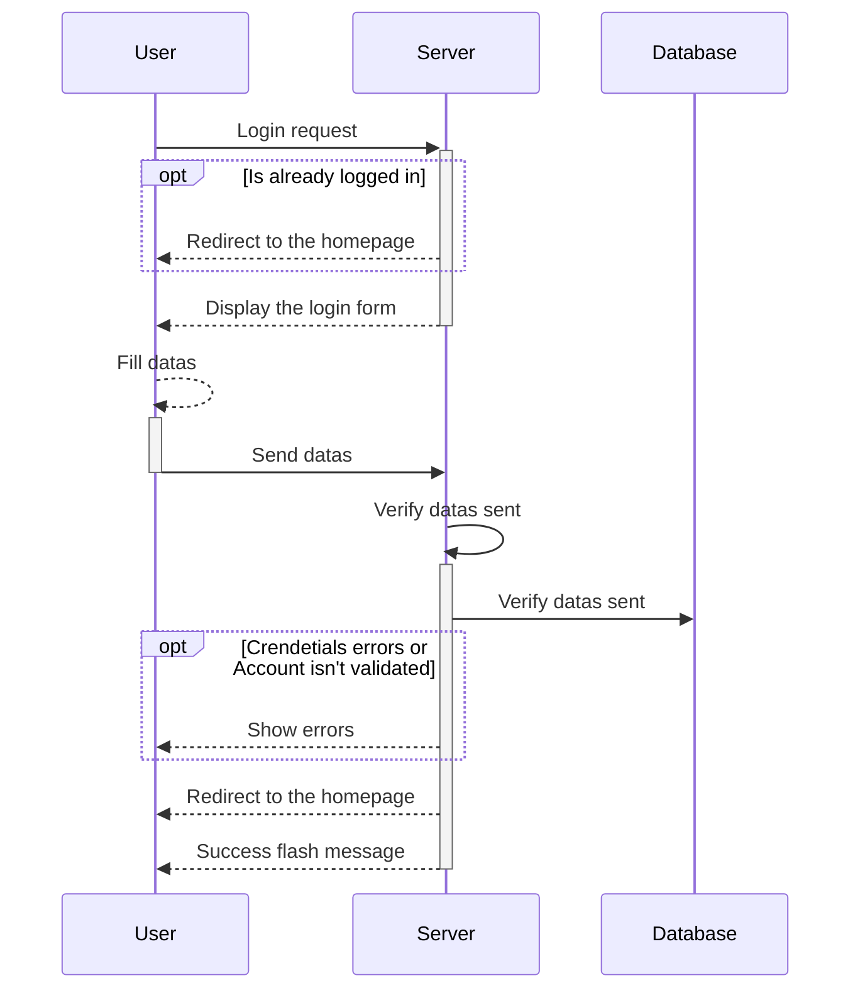

```mermaid
sequenceDiagram
    User ->>+ Server: Login request

    opt Is already logged in 
        Server -->> User: Redirect to the homepage
    end

    Server -->>- User: Display the login form

    User -->>+ User: Fill datas
    User ->>- Server: Send datas

    Server ->>+ Server: Verify datas sent
    Server ->> Database: Verify datas sent


    opt Crendetials errors or Account isn't validated
        Server -->> User: Show errors
    end

    Server -->> User: Redirect to the homepage
    Server -->>- User: Success flash message
```
