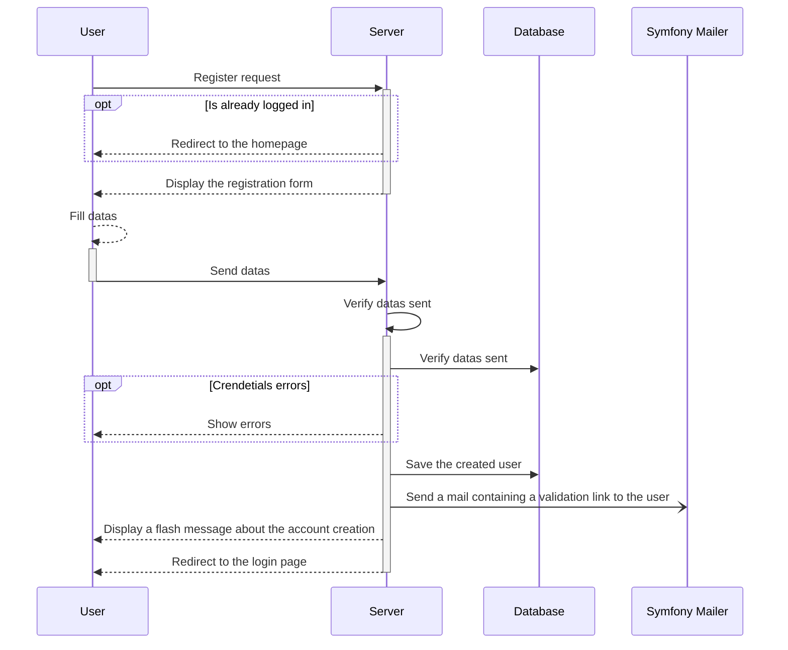

```mermaid
sequenceDiagram
    User ->>+ Server: Register request

    opt Is already logged in 
        Server -->> User: Redirect to the homepage
    end

    Server -->>- User: Display the registration form

    User -->>+ User: Fill datas
    User ->>- Server: Send datas

    Server ->>+ Server: Verify datas sent
    Server ->> Database: Verify datas sent


    opt Crendetials errors
        Server -->> User: Show errors
    end

    Server ->> Database: Save the created user
    Server -) Symfony Mailer: Send a mail containing a validation link to the user

    Server -->> User: Display a flash message about the account creation
    Server -->>- User: Redirect to the login page
```
