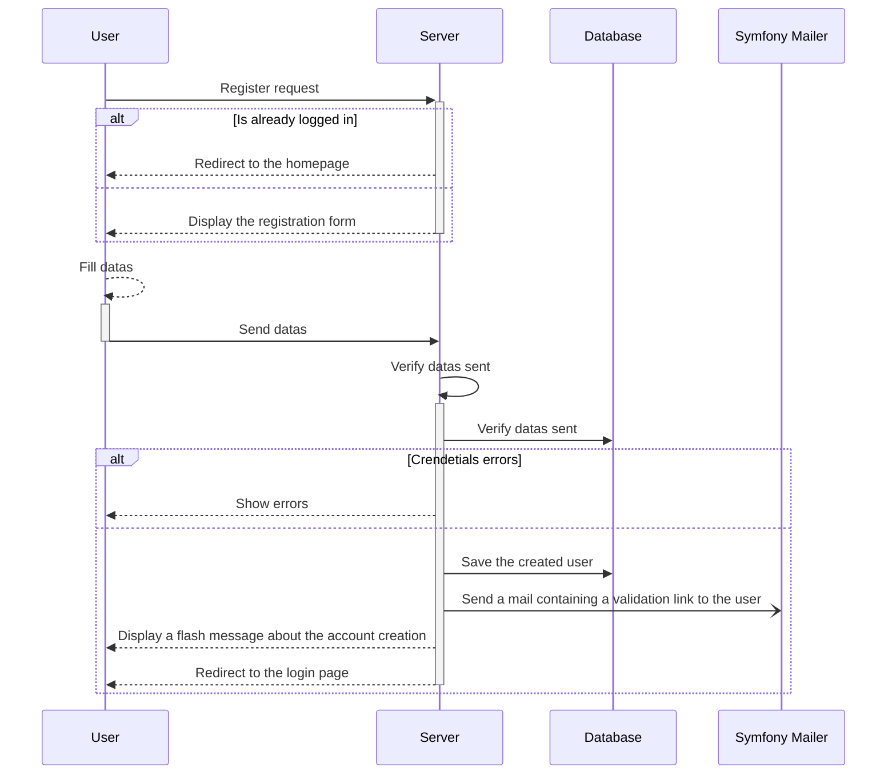

```mermaid
sequenceDiagram
    User ->>+ Server: Register request

    alt Is already logged in 
        Server -->> User: Redirect to the homepage
    else
        Server -->>- User: Display the registration form
    end

    User -->>+ User: Fill datas
    User ->>- Server: Send datas

    Server ->>+ Server: Verify datas sent
    Server ->> Database: Verify datas sent

    alt Crendetials errors
        Server -->> User: Show errors
    else
        Server ->> Database: Save the created user
        Server -) Symfony Mailer: Send a mail containing a validation link to the user
        
        Server -->> User: Display a flash message about the account creation
        Server -->>- User: Redirect to the login page
    end
```
