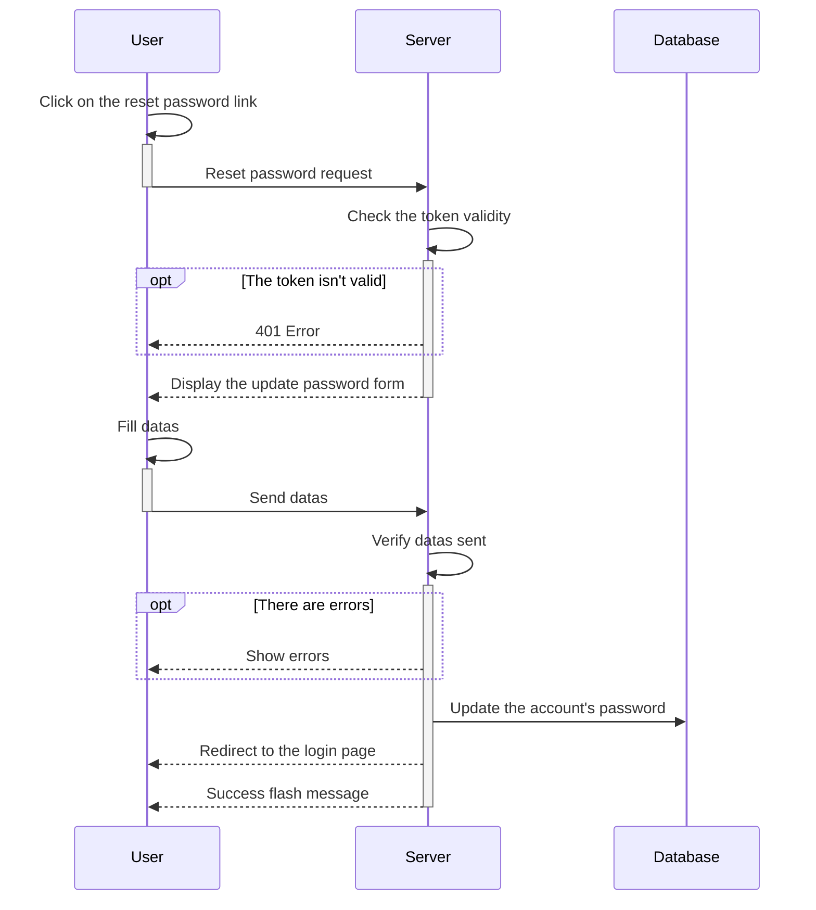

```mermaid
sequenceDiagram
    User ->>+ User: Click on the reset password link
    User ->>- Server: Reset password request

    Server ->>+ Server: Check the token validity

    opt The token isn't valid
        Server -->> User: 401 Error 
    end

    Server -->>- User: Display the update password form
    User ->>+ User: Fill datas
    User ->>- Server: Send datas

    Server ->>+ Server: Verify datas sent

    opt There are errors
        Server -->> User: Show errors
    end

    Server ->> Database: Update the account's password

    Server -->> User: Redirect to the login page
    Server -->>- User: Success flash message
```
