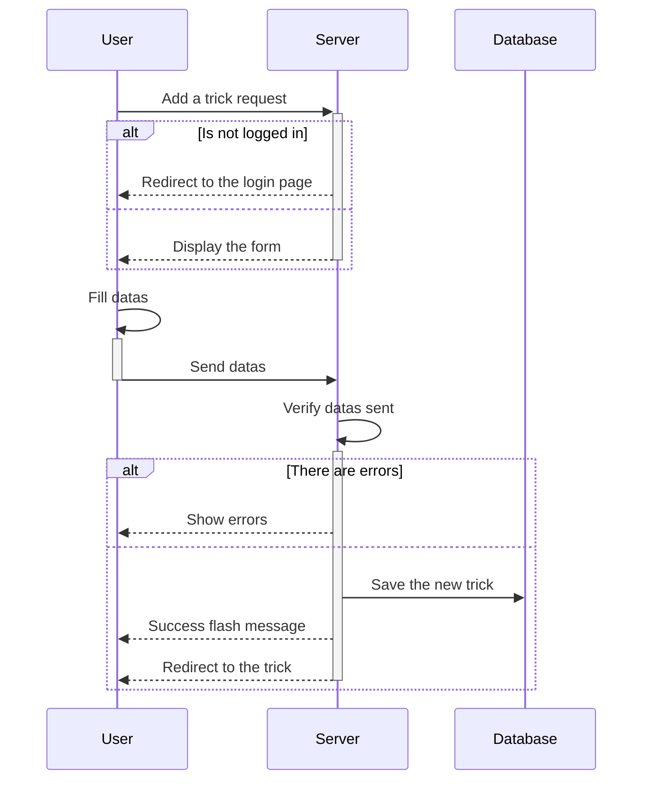

```mermaid 
sequenceDiagram
    User ->>+ Server: Add a trick request
    
    alt Is not logged in 
        Server -->> User: Redirect to the login page
    else
        Server -->>-User: Display the form
    end
    
    User ->>+ User: Fill datas
    User ->>- Server: Send datas

    Server ->>+ Server: Verify datas sent

    alt There are errors
        Server -->> User: Show errors
    else
       Server ->> Database: Save the new trick
        Server -->> User: Success flash message
        Server -->>- User: Redirect to the trick 
    end
```
