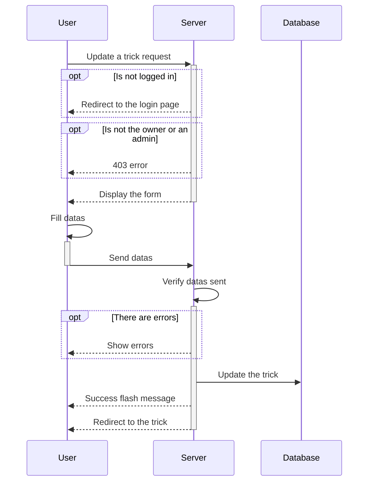

```mermaid 
sequenceDiagram
    User ->>+Server: Update a trick request

     opt Is not logged in 
        Server -->> User: Redirect to the login page
    end

    opt Is not the owner or an admin
        Server -->> User: 403 error
    end

    Server -->>-User: Display the form

    User ->>+ User: Fill datas
    User ->>- Server: Send datas

    Server ->>+ Server: Verify datas sent

    opt There are errors
        Server -->> User: Show errors
    end

    Server ->> Database: Update the trick
    Server -->> User: Success flash message
    Server -->>- User: Redirect to the trick
```
