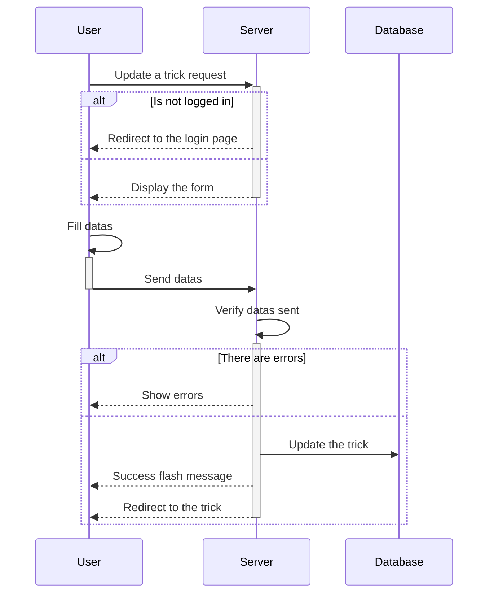

```mermaid 
sequenceDiagram
    User ->>+ Server: Update a trick request

    alt Is not logged in 
        Server -->> User: Redirect to the login page
    else
        Server -->>-User: Display the form
    end
    
    User ->>+ User: Fill datas
    User ->>- Server: Send datas

    Server ->>+ Server: Verify datas sent

    alt There are errors
        Server -->> User: Show errors
    else
        Server ->> Database: Update the trick
        Server -->> User: Success flash message
        Server -->>- User: Redirect to the trick
    end
```
